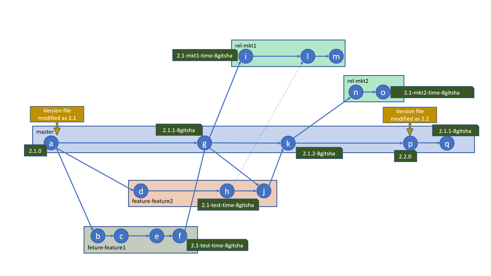

# Build System (CI)

This document explains the build system designed and incorporated in Zero Waste Team Project. The document is structured as below
* [Vision](BuildSystem.md#vision)
* [Tools](BuildSystem.md#tools)
* [Branching stratergy](BuildSystem.md#branching-stratergy)
* [Versioning stratergy](BuildSystem.md#versioning-stratergy)
* [Imposed Constraints](BuildSystem.md#imposed-constraints)
* [Build triggers](BuildSystem.md#build-triggers)
* [Setting up a repository](BuildSystem.md#setting-up-repository)

## Vision

The code is versioned in Git repositories by the Zero Waste Team. The CI system is envisioned to be build around the git repositories that has the following goals met. 
* On checkin/push/merge in to specific branches, the solution is build, unit tested and artifact is published
* The most important customer of the CI system is the developement team. And the CI system should serve the development team by meeting the following
  * The CI system would be set up every time a new repo is created. It must be very easy to set it up. The setup should take utmost 10 mins.
  * The builds should be fast and unwanted tasks should not happen in the build
  * The builds would be more frequent in the working hours and less in the non working hours. So the infrastructure should be elastic
  * The system should give clear version numbers for the artifacts
  * There should be traceability between the artifact and git commit
  * There should be good dashboard that gives the overall picture of various projects in the organization
  * The system should provide a mechanism to share libraries (such as Maven, Nuget, Npm) between project 
* The needs of the Operation team should be clearly
  * The artifacts produced by the system have to deployed. When the artifact is a zipped file or folder, the deployment procedure would not be clear for the operation team. So the artifact has to be documented standard artifacts such as docker images, helm charts, etc...
* The needs of the management has to be met
  * The solution should be cost effective
  * The amount of developers needed to maintain the system has to be minimal or zero.

## Tools
* **Repo:** The source code is maintained in git repositories that are hosted in **GitHub**
* **Build Tool:** The build tool used in **[GitHub Actions](https://help.github.com/en/actions)** 
* **Artifactory:** The artifactory used is **[GitHub packages](https://help.github.com/en/packages/publishing-and-managing-packages/about-github-packages)**

**Note 1**: [Circle CI](https://circleci.com/) and [Travis CI](https://travis-ci.org/) are better and more mature than [GitHub Actions](https://help.github.com/en/actions) in many aspects such as dashboarding. [GitHub Actions](https://help.github.com/en/actions) lacks organizational secrets where as [Circle CI](https://circleci.com/) has it. GitHub actions short fall in these two aspects is overlooked as billing becomes easier. (One bill for Repositories and build tool). The integration is also out of the box between GitHub repos and GitHub Actions.

**Note 2**: [JFrog Artifactory](https://jfrog.com/artifactory/) and [ProGet](https://inedo.com/proget) are better than GitHub Packages in few aspects. Both JFrog Artifactory and ProGet supports npm, maven, nuget, docker and helm. Where as GitHub Packages does not support help out of the box. GitHub Package's default behaviour is artifact repository per code repository. This is clearly not convenient to use. As the consumers have to consume from several artifact repositories. The access management of GitHub packages makes it easy and secure to consume artifacts for local and ci builds. Artifactory or ProGet as managed services is either not available or expensive. To save the effort of hosting artifact respositories and benefit from the feature provided by GitHub packages, it is choosen 

## Branching Stratergy

When using a git repository, its important have a proper branching stratery in place. There are many popular branching stratergies such as [Git Flow](https://www.atlassian.com/git/tutorials/comparing-workflows/gitflow-workflow), [Github Flow](https://help.github.com/en/github/collaborating-with-issues-and-pull-requests/github-flow), [GitLab Flow](https://docs.gitlab.com/ee/topics/gitlab_flow.html), [Release Flow](https://docs.microsoft.com/en-us/azure/devops/learn/devops-at-microsoft/release-flow), etc...

The appropriate branching model for the project has to be decided based on several factors. They are listed below
* The type of product (Libraries, Desktop application, Mobile application, Monolithic Web applicaiton, Microservice based Web application)
* The number of developers working on the product
* The experience level of the developers
* The release cycle of the product
* The number of variants of the product

Based on the above points and a few assumptions, the following are branching stratergies are adopted

* **Library Projects:** [GitHub flow](GitHubFlow.md) will be adopted for library projects (that produce artifacts such as maven, nuget, npm packages)
* **Web Application Project:** [Release flow](ReleaseFlow.md) will be adopted for web application projects (these projects will produce docker images and helm chats as artifacts) 

## Versioning Stratergy
The artifacts produced will be versioned as per [semantic versioning](https://semver.org/)

* Every repository will have a file named "version.txt" in the root of the repository
* The version.txt will contain the major and minor version in the format <MajorVersion>.<MinorVersion>
* The version of the artifact is generated based on the branch

### Master branch build
* [MajorVersion].[MinorVersion].[BuildNumber] if the build number is 0
* [MajorVersion].[MinorVersion].[BuildNumber]-[8 char git sha] if the build number is non zero.
* If the version.txt is modified, the build number is 0, otherwise the number of commits since modification is the build number.

### Release branch build
* [MajorVersion].[MinorVersion]-[releasename]-[time]-[8 char git sha]
* date is in yyyy-MM-dd-HH-mm-ss format
* release name is branch name with prefixing "release-" removed

### Feature branch build
* [MajorVersion].[MinorVersion]-[test]-[time]-[8 char git sha]
* date is in yyyy-MM-dd-HH-mm-ss format

### Snapshot of versioning

## Imposed Constraints
* There are some constraints imposed in the CI system. These constraints are imposed for maintiaining the quality of the software and for traceability purposed.
* Contraints are imposed through GitHub settings and PR build.
* The constraints for all the repositories (libraries and web applications) are as below
  * Pushing commits to remote master is forbidden. Commits have to be merged in master through pull requests.
  * It is required that source branch is up to date for a pull request. (We could simply say, the feature branch must be master on the latest master)
  * When a version is updated, the version has to properly incremented. Decrementing version is not allowed
  * When a version is updated, there shall be no other changes in that pull request
  * The code after pull request merge should be buildable without any compilation errors or unit test failures
  * The commits in the master and release-* branches shall have a linear commit history. This means we will not allow a merge commit
  * Rebase merge commit also will not be allowed. The only merge type that will be supported is squash merge
* The additional contraints for web application repositories are a below
  * Pushing commits to remote branch whose name starts with "release-" is forbidden. Commits have to be merged through pull requests.
  * It is requried the source branch is up to date.
  * Version update is not allowed while merging to release branches
  * The code after pull request merge should be buildable without any compilation errors or unit test failures

### Caveat
* It's at this moment not restrict pushing to a remote non-existant branch named release-* As a work around, when pushed the dashboard should show a warning

## Build Triggers
* A PR build should be triggered when a pull request to raised to merge to master or release-*
* A master build should be triggered when code is merged in master or release-*
* Due to limitation of the artifact repository, all the builds might not be stored forever in the artifact repository.
* A master build should be triggered when a build requested through the buildRequestor tool. This tool shall be replaces as web application.
* Based on the branch requested in the buildRequestor tool, the build could build a test artifact, release artifact or full versioned artifact

## Setting up repository
* Create a git hub repository
* Clone the empty repository
* In the root of the repository, create a folder named .github
* Create a file named version.txt in the root of the repo. The contents of this file should be 0.1 without a new line
* Create a file named appType.txt, the contents of this file should be
  * for MavenJavaPackage - "MavenJava"
  * for JavaWebApplication -"WebJava"
* Copy the contents of zip in to the .github folder
  * For MavenJavaPackage built by gradle [this](https://wondertools.github.io/GitHubDownloader/#/home?url=https://github.com/ZeroWasteTeam/SampleJavaMavenPackage/tree/master/.github)
  * For JavaWebApplication built by gradle this
* Commit all changes till now and push to origin
* Create a new branch name 'firstbranch', in the branch add a file first.txt with contents 'hello'. Commit the changes and push
* Create a pull request for the newly created branch. (This pull request is a dummy pull request to ensure the checks are run and recognized)
Go to settings of the project repository, and ensure the following
* In features
  * Uncheck "Wikis"
  * Uncheck "Restrict editing to users in teams with push access only"
  * Uncheck "Issues"
  * Uncheck "Sponsorships"
  * Uncheck "Projects"
* In Data Services
  * Make sure "Security alerts" is checked
* Merge Button
  * Uncheck "Allow merge commits"
  * Make sure "Allow squash merging" is checked
  * Uncheck "Allow rebase merging"
  * Uncheck "Automatically delete head branches"
* In Settings page, go to branches, click on add rules
  * Enter the branch name as "master"
  * Check "Require pull request reviews before merging"
  * Check "Require status checks to pass before merging"
  * Check sub section "Require branches to be up to date before merging"
  * Check sub section "Java PR Build"
  * Check "Require linear history"
  * Check "Include administrators"
  * And then click on "Create"
* For Web applications
  * Add a new rule with the same details for the branch pattern named "release-*"

## Examples

* A sample Maven package project in Java build using gradle is [here](https://github.com/ZeroWasteTeam/SampleJavaMavenPackage)
